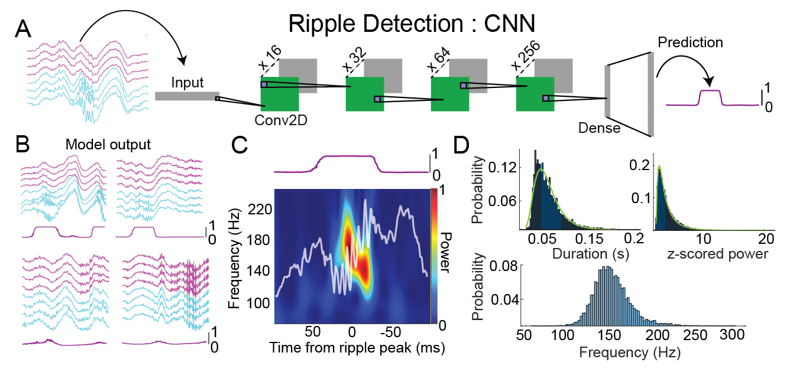

# ripNet_CNN
Custom convolutional neural network for detecting hippocampal sharp wave ripples. Described in Cooper _et al._ 2025 [link](https://elifesciences.org/reviewed-preprints/101105)
Pytorch code includes scripts for interpreting the model via saliency maps and Grad-CAM. 

